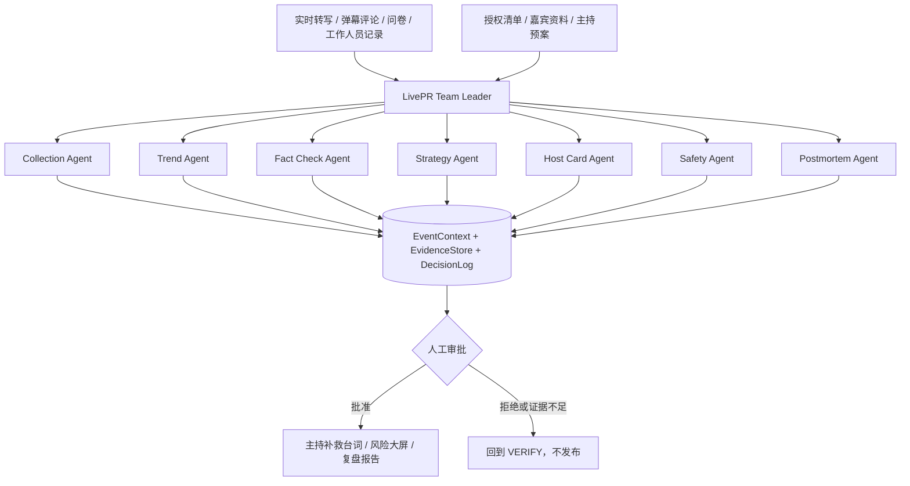

# 舆情宝 LivePR

> 面向发布会、论坛、直播与大型活动的现场舆情监测和主持决策 Agent Team。

一次活动中，嘉宾临时说出未经许可的内容。现场团队来不及确认授权范围、判断传播风险，也无法及时给主持人一段安全、自然、可执行的补救台词，最终影响活动正常举行。

LivePR 将这类高压场景拆成一条可审计的决策链：**发现风险 → 核查授权与事实 → 生成策略 → 人工审批 → 交付主持台词 → 持续监测与复盘**。系统不会自动对外发布内容；高风险响应只有在主持人或公关负责人具名批准后才进入主持控制台。

## 当前进展

- 可运行的确定性 MVP，无需 API Key，Python 3.10+ 标准库即可复现。
- 1 个 Team Leader、7 个业务 Agent、6 个可复用 Skills。
- 2 个虚构模拟场景，覆盖“产品延期传言”和“嘉宾临时改动议程”。
- 4 项自动化测试，覆盖审批门、证据不足回退、场景复用与 HTTP Gateway。
- 生成 JSON、JSONL、主持提词卡、Markdown 报告和自包含 HTML 大屏。
- 已完成 AgentTeams Identity、Team Spec、创建消息与 HTTP/MCP 等价工具契约。

> 仓库中的事件、评论、人物和比例全部是脱敏的虚构模拟数据，只用于验证流程，不代表真实活动效果。

## 方案结构



共享上下文记录转写片段、授权状态、证据 ID、风险等级、台词版本和当前状态。Agent 只读写自己负责的字段；信息不足或结论冲突时，由 Team Leader 重新路由并回到 `VERIFY`。

## Agent 与职责

| 角色 | 职责 | 核心 Skill |
| --- | --- | --- |
| LivePR Team Leader | 任务拆解、路由、状态维护、冲突仲裁 | 状态机与证据汇总 |
| Collection Agent | 聚合并规范化现场信号 | 输入规范化 |
| Trend Agent | 识别负面集中、热点与窗口突变 | `trend-burst-detect` |
| Fact Check Agent | 对照授权清单和事实库核查主张 | `fact-check` |
| Strategy Agent | 风险分级并形成澄清、安抚、转场策略 | `risk-grade`, `response-plan` |
| Host Card Agent | 只基于已核事实生成短主持台词 | `host-card` |
| Safety Agent | 检查证据、禁用表达、长度与审批状态 | `risk-grade`, `host-card` |
| Postmortem Agent | 对比模拟反馈并形成事件时间线 | `postmortem` |

## 最快运行

```bash
git clone https://github.com/paofuxiaomiao/livepr-agent-team.git
cd livepr-agent-team/workspace/livepr-mvp

# 运行测试
python3 -m unittest discover -s tests -v

# 具名批准：流程进入 closed 并生成完整证据
python3 run_demo.py \
  --scenario product_delay_rumor \
  --approve \
  --approved-by demo-reviewer
```

不带批准参数时，系统必须停在 `awaiting_approval`：

```bash
python3 run_demo.py \
  --scenario product_delay_rumor \
  --output-dir evidence/product-delay-awaiting
```

复用第二个场景：

```bash
python3 run_demo.py \
  --scenario keynote_schedule_change \
  --approve \
  --approved-by demo-reviewer
```

一次完整运行会生成：

```text
evidence/<run-name>/
├── result.json          # 完整结构化结果
├── agent-trace.jsonl    # Agent 状态与输出摘要
├── host-card.txt        # 主持补救台词
├── report.md            # 可读事件报告
└── dashboard.html       # 自包含结果大屏
```

## HTTP 工具网关

终端 1：

```bash
cd workspace/livepr-mvp
python3 tools/mock_event_gateway.py --host 127.0.0.1 --port 18090
```

终端 2：

```bash
curl http://127.0.0.1:18090/health
python3 run_demo.py \
  --scenario product_delay_rumor \
  --approve \
  --gateway-url http://127.0.0.1:18090 \
  --output-dir evidence/product-delay-http
```

AgentTeams Worker 位于 Docker 时，可将工具地址替换为 `http://host.docker.internal:18090`。

## 状态机与安全边界

```text
RECEIVED
  → COLLECTED
  → TRIAGED
  → VERIFIED
  → PLANNED
  → CARD_DRAFTED
  → AWAITING_APPROVAL ──拒绝/缺证据──→ 保持不发布
  → DELIVERED ──仅主持控制台──→ MONITORING
  → CLOSED
```

- `fact-check` 无证据时返回 `insufficient_evidence`，禁止补全未知事实。
- P1/P2 默认要求人工批准，审批人和台词版本写入 Trace。
- `external_auto_publish` 永远为 `false`，仓库不实现外部平台自动发布。
- 真实活动数据、账号、手机号、密钥、Token 和私有事实库不进入仓库。
- 上一份已批准台词可作为回滚版本，新版本撤回会写入审计日志。

## 目录

```text
.
├── workspace/livepr-mvp/       # LivePR 原创 MVP
│   ├── agents/                 # 7 个 Agent Identity
│   ├── at/                     # AgentTeams Team Spec 与运行消息
│   ├── livepr/                 # 编排器、Agent、Skills 与渲染逻辑
│   ├── skills/                 # 6 个可复用 Skill 契约
│   ├── scenarios/              # 虚构模拟事件
│   ├── tools/                  # Local/HTTP Event Gateway
│   ├── tests/                  # 自动化测试
│   └── evidence/               # 已验证运行证据
├── submission/                 # 最终作品简介、方案与提交说明
├── web/                        # 项目展示网站
└── README.md
```

## AgentTeams 接入

- [`at/AgentTeam.md`](workspace/livepr-mvp/at/AgentTeam.md)：Team、共享状态和安全边界。
- [`at/create_agents_messages.md`](workspace/livepr-mvp/at/create_agents_messages.md)：发送给 AgentTeams Manager 的创建消息。
- [`at/run_demo_task_message.md`](workspace/livepr-mvp/at/run_demo_task_message.md)：发送到 Team 房间的演示任务。
- [`at/team_spec.json`](workspace/livepr-mvp/at/team_spec.json)：机器可读的 Agent Identity、Skills 和工具契约。

本地确定性执行是可复现 fallback。下一阶段将各业务角色替换为 AgentTeams Worker，并补充真实模型的延迟、成本、稳定性和事实准确率评测。

## 展示网站

`web/` 将提供一页式编辑型项目案例：真实问题、Agent 协作、核心 Skill、安全机制、运行证据、团队与项目积累。页面使用原创配图，任何情境图都会明确标注为概念演绎，不冒充真实活动证据。

## 团队

- 扶瑀琪：项目负责人、产品与现场策略。
- 欧阳劲汝：AIGC 视频制作。
- 张佳佳：视觉内容负责人、AIGC 内容主创。

## 路线图

- [x] 确定性多 Agent MVP、审批门与证据链。
- [x] Local/HTTP Event Gateway 与自动化测试。
- [x] AgentTeams Team Spec、Skills 和创建消息。
- [ ] 实时音频/字幕适配器与授权资料 RAG。
- [ ] AgentTeams Worker、延迟/成本/稳定性评测。
- [ ] 30 秒应急演练、2–3 分钟演示视频与授权活动试点。

## 许可证与第三方边界

原创 MVP 代码按 [Apache License 2.0](LICENSE) 发布。第三方系统、模型、数据和活动素材的使用条件见 [`THIRD_PARTY.md`](workspace/livepr-mvp/THIRD_PARTY.md)。

本项目用于活动应急决策辅助，不替代法律、合规或专业公关判断。任何真实活动部署都需要完成数据授权、隐私脱敏、人员培训和人工审批配置。
